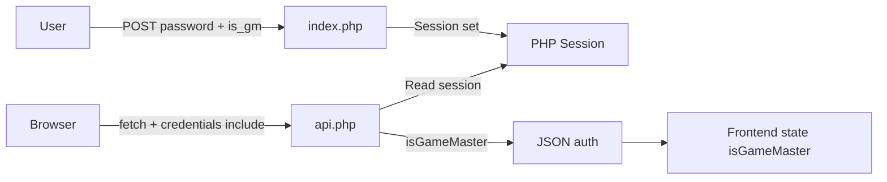
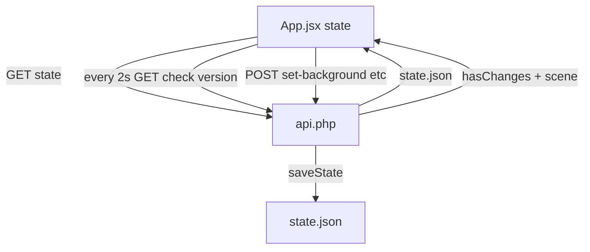

# Tutorial: Jak zbudować aplikację FreeRoll VTT krok po kroku

## Generated via Cursor

Ten tutorial prowadzi przez stworzenie aplikacji Virtual TableTop (VTT) od zera: logowanie z hasłem gracza/MG, backend PHP z jednym plikiem stanu, frontend React z Vite, siatka z tłem i tokenami, mgła wojny, sceny, kości, ping, uploady oraz finalny build z wstrzykiwaniem haseł.

Kolejność kroków pozwala po każdym etapie uruchomić lub zbudować aplikację i **sprawdzić działanie** (sekcja „Jak sprawdzić” w każdym kroku).

---

## Wymagania

- **Node.js 18+** – do budowania frontendu i uruchamiania `build.bat`
- **PHP 7.4+** – serwer API i strona logowania
- **Serwer WWW** – Apache (z mod_rewrite opcjonalnie) lub nginx, z obsługą PHP
- **Windows** – jeśli używasz dostarczonego `build.bat` i `build-helper.ps1` (na innych systemach można zaimplementować odpowiednik w bashu)

---

## Spis treści

| Krok | Plik | Opis |
|------|------|------|
| 1 | [step-01-server-and-login.md](step-01-server-and-login.md) | Serwer PHP, sesja, strona logowania (index.php) z formularzem, dwa hasła, checkbox „Jestem MG”. Szablon i placeholdery do generowania build/index.php. |
| 2 | [step-02-backend-api.md](step-02-backend-api.md) | Jeden plik api.php: CORS, .env, isAuthenticated/isGameMaster (dev vs prod). Endpoint GET `auth`. |
| 3 | [step-03-frontend-scaffold.md](step-03-frontend-scaffold.md) | Vite + React: index.html, main.jsx, App.jsx, config.js (BASE_PATH, API_BASE z env). .env.example. |
| 4 | [step-04-state-and-polling.md](step-04-state-and-polling.md) | Backend: state.json, getState/saveState, GET state, GET check?version=. Frontend: ładowanie stanu, polling co 2 s. |
| 5 | [step-05-grid-and-background.md](step-05-grid-and-background.md) | Backend: set/remove-background, lista tła. Frontend: Grid (siatka, scroll), wybór tła w Sidebar. |
| 6 | [step-06-map-elements-and-tokens.md](step-06-map-elements-and-tokens.md) | Backend: list-map, list-tokens, add/move/update/remove. Frontend: AssetBrowser, Token/MapElement, klik i drag & drop. |
| 7 | [step-07-fog-of-war.md](step-07-fog-of-war.md) | Backend: fog w stanie sceny, set-fog, update-fog, toggle-fog. Frontend: bitmapa mgły, canvas, tryb edycji (GM). |
| 8 | [step-08-scenes.md](step-08-scenes.md) | Backend: create/delete/rename/switch/duplicate-scene. Frontend: SceneManager, przełączanie i zarządzanie scenami. |
| 9 | [step-09-dice-and-rolls.md](step-09-dice-and-rolls.md) | Backend: roll, rolls, clear-rolls. Frontend: DicePanel, historia rzutów (polling). |
| 10 | [step-10-ping.md](step-10-ping.md) | Backend: send-ping, clear-ping, GET ping. Frontend: tryb ping, scroll do punktu, animacja. |
| 11 | [step-11-uploads-and-gm.md](step-11-uploads-and-gm.md) | Backend: upload-asset (token/map/background/template/paper), isGameMaster. Frontend: UploadSection tylko dla GM. |
| 12 | [step-12-notes-pdf-macros.md](step-12-notes-pdf-macros.md) | Backend: list-templates, get-template, list-papers, get-paper. Frontend: BottomPanel, NotesPanel, PdfPanel, MacroEditor. |
| 13 | [step-13-build-and-deploy.md](step-13-build-and-deploy.md) | build.bat: PASSWORD, GM_PASSWORD, .env frontendu, npm run build, kopiowanie, build-helper.ps1, .htaccess. Deploy. |

---

## Przepływ logowania i roli

Logowanie odbywa się przez formularz POST do `index.php`. Hasła są wstrzykiwane przy buildzie do wygenerowanego `index.php` (stałe PHP). Frontend nigdy nie otrzymuje haseł – każdy request do API wysyła cookie sesji (`credentials: 'include'`).

---

## Przepływ stanu i synchronizacji

Stan gry (sceny, tło, tokeny, mgła itd.) jest przechowywany w jednym pliku `state.json`. Frontend przy starcie pobiera stan (`GET state`), a co 2 sekundy pyta o zmiany (`GET check?version=...`). Modyfikacje (np. set-background) są wysyłane POST do api.php, który zapisuje zaktualizowany stan do pliku.

---

## Jak korzystać z tutorialu

1. Rozpocznij od **Kroku 1**: utwórz katalog projektu, plik logowania i szablon.
2. Po każdym kroku wykonaj sekcję **„Jak sprawdzić”** – upewnij się, że aplikacja (lub dany fragment) działa.
3. Kod w tutorialu zawiera **komentarze po polsku** – możesz kopiować fragmenty i dostosowywać je do swojej struktury folderów.
4. W wywołaniach API zawsze używaj **`credentials: 'include'`** w `fetch`, aby przeglądarka wysyłała cookie sesji.
